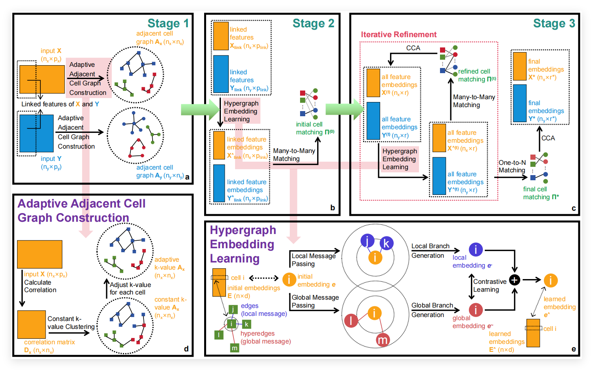

# MMIHCL: single-cell MultiModal data Integration through Hypergraph Contrastive Learning

<hr style="border: 0; height: 1px; background-image: linear-gradient(to right, rgba(0, 0, 0, 0), rgba(128, 128, 128, 0.75), rgba(0, 0, 0, 0));">

## Description

The full description of MMIHCL and its application on published single-cell multimodal dataset integration are available.

This repository includes detailed installation instructions, data requirements, and tutorials.


<hr style="border: 0; height: 1px; background-image: linear-gradient(to right, rgba(0, 0, 0, 0), rgba(128, 128, 128, 0.75), rgba(0, 0, 0, 0));">

## Installation instruction

We recommend the following steps to install MMIHCL.

Firstly, create a new python environment.

```python
conda create -n env_name python==3.11.9 # You can set env_name by yourself
conda activate env_name
```

Secondly, install the following dependencies.

```python
pip install torch==2.4.0 torchvision==0.19.0 torchaudio==2.4.0 --index-url https://download.pytorch.org/whl/cu121
# The versions of torch, torchvision, and torchaudio may need to be adapted to your hardware configuration.
pip install jupyter ipykernel pandas anndata matplotlib scikit-learn scanpy
```

In addition, we also provide [environment.yml](./environment.yml) and [requirements.txt](./requirements.txt) for you to set up an environment to run MMIHCL.


<hr style="border: 0; height: 1px; background-image: linear-gradient(to right, rgba(0, 0, 0, 0), rgba(128, 128, 128, 0.75), rgba(0, 0, 0, 0));">

## Data requirements

MMIHCL's pipeline reads files in h5ad format as input.
We use the [anndata](https://github.com/scverse/anndata) tookit to read an h5ad file that represents some kind of modality data in a dataset to get the AnnData object of the following form as an example.
We name the AnnData object ''adata'', where:

1. adata.X represents the modality counting matrix stored by a dense or sparse matrix.
2. adata.obs represents the observation of adata, which needs to contain cell type information  for evaluation.
3. adata.var represents the variable of adata, which will be used to divide the linked and modal-specific features of different modality data.

For raw data stored in other formats, we recommend first converting them to h5ad format files, to make it easier to run MMIHCL's pipeline.

<hr style="border: 0; height: 1px; background-image: linear-gradient(to right, rgba(0, 0, 0, 0), rgba(128, 128, 128, 0.75), rgba(0, 0, 0, 0));">

## Tutorials

Example 1: Weak Linkage Dataset Integration on CITE-seq PBMC, see [tutorial_1.ipynb](./mmihcl/tutorial_1.ipynb).

Example 2: Strong Linkage Dataset Integration on CyTOF human H1N1 & IFNG, see [tutorial_2.ipynb](./mmihcl/tutorial_2.ipynb).
